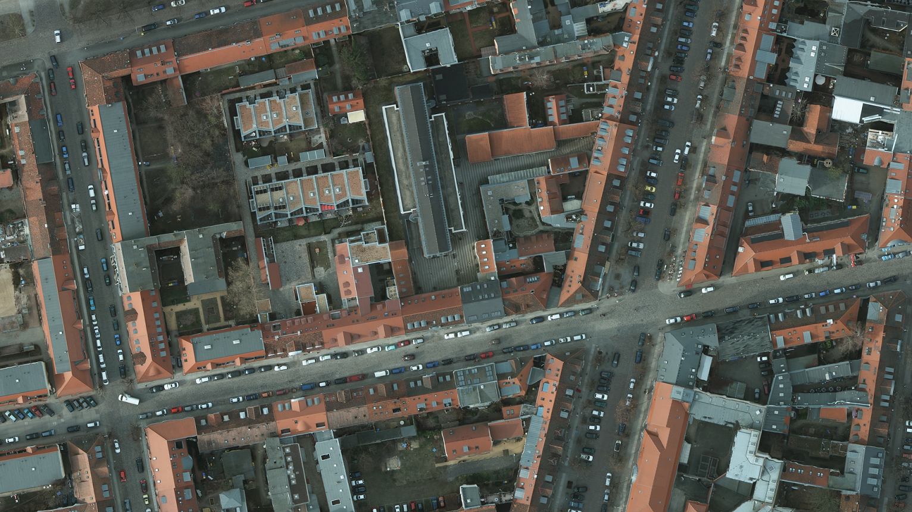
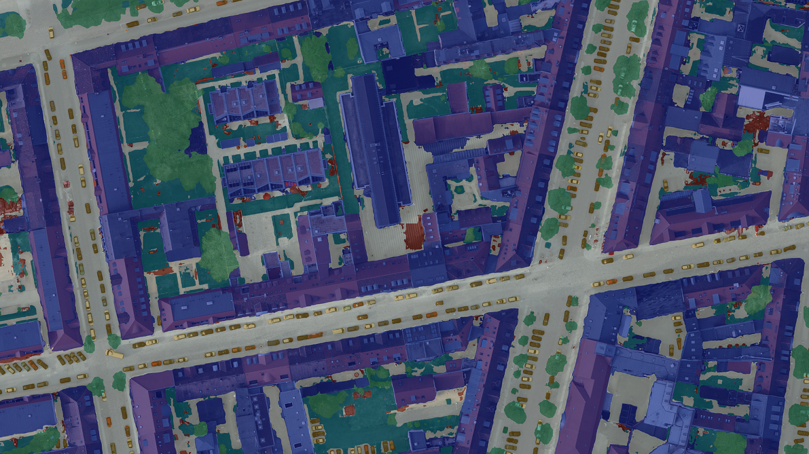
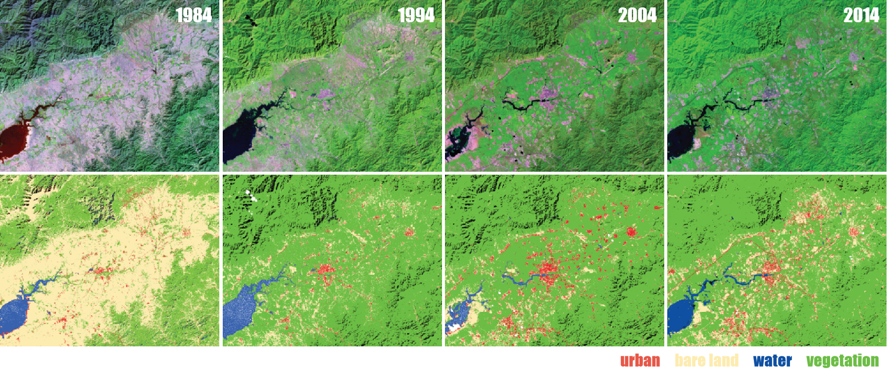
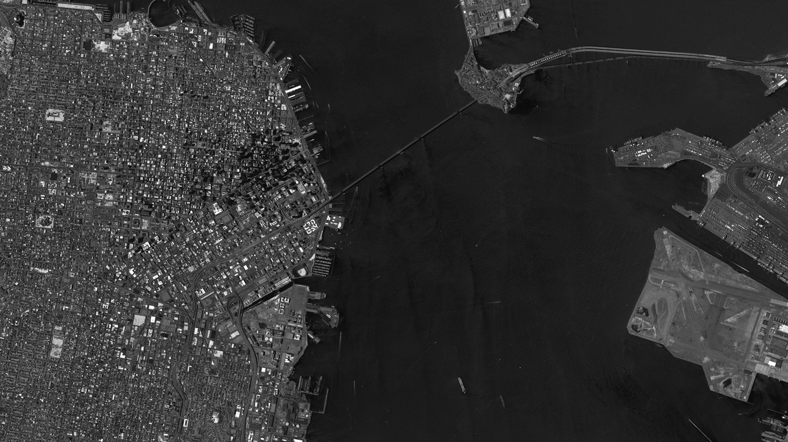
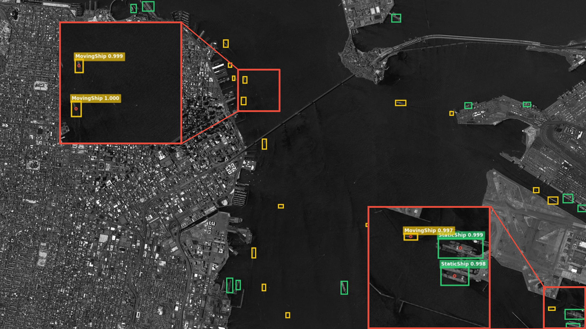
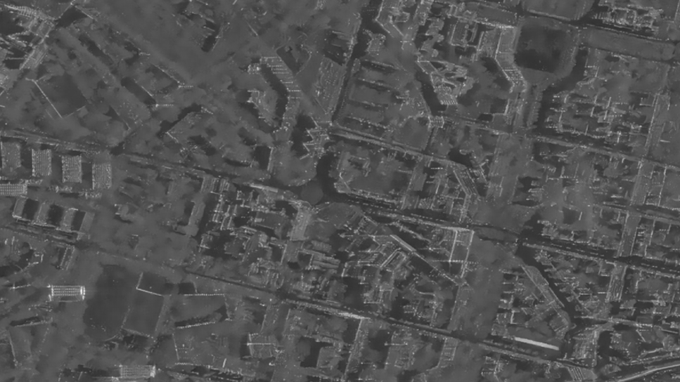
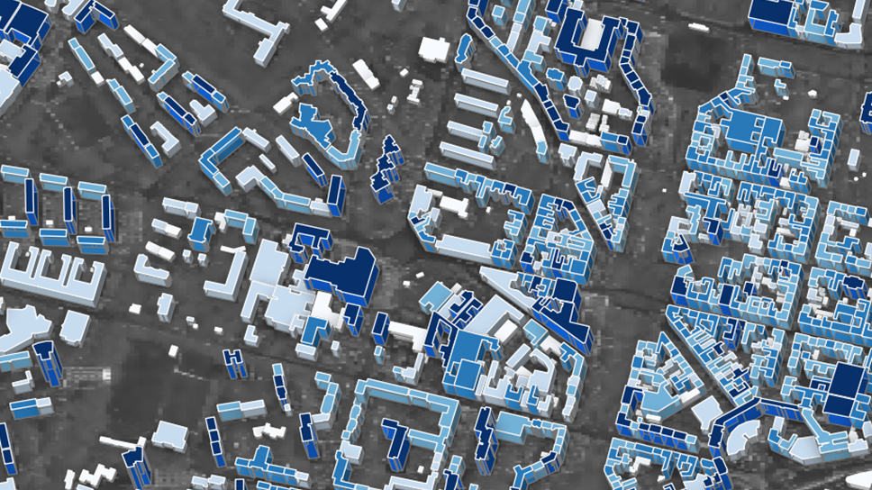

# Some stuff my awesome colleagues and I did.

<video src="videos/era_demo.mp4" controls width="100%"></video>
# What's happening down there? Dynamic event recognition in UAV videos.

​<video src="videos/vehicle_det_track.mp4" autoplay class="embed-responsive rounded" loop muted playsinline poster="" width="100%"></video>
# Vehicle detection and tracking in UAV videos. (@a busy parking lot, Woburn, Massachusetts, US)

# #Test2

<link
  rel="stylesheet"
  href="https://unpkg.com/img-comparison-slider@3/dist/collection/styles/initial.css"
/>

	
	
</img-comparison-slider>

# #Semantic segmentation of aerial imagery

<link rel="stylesheet" type="text/css" href="image-comparison-slider.css">

    

    
    

An example of the city of Potsdam, Germany.

# #Multi-temporal satellite image sequence analysis

An example of urban expansion in Yanqing, Beijing, China.

# #Ship detection in satellite imagery

<link rel="stylesheet" type="text/css" href="image-comparison-slider.css">

    

    
    

An example of the San Francisco Bay, US.

# #Height estimation from a single satellite imagery

<link rel="stylesheet" type="text/css" href="image-comparison-slider.css">

    

    
    

An example in Berlin, Germany.