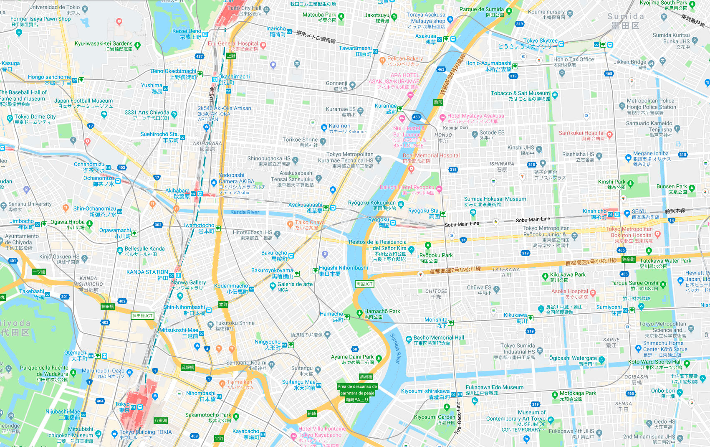
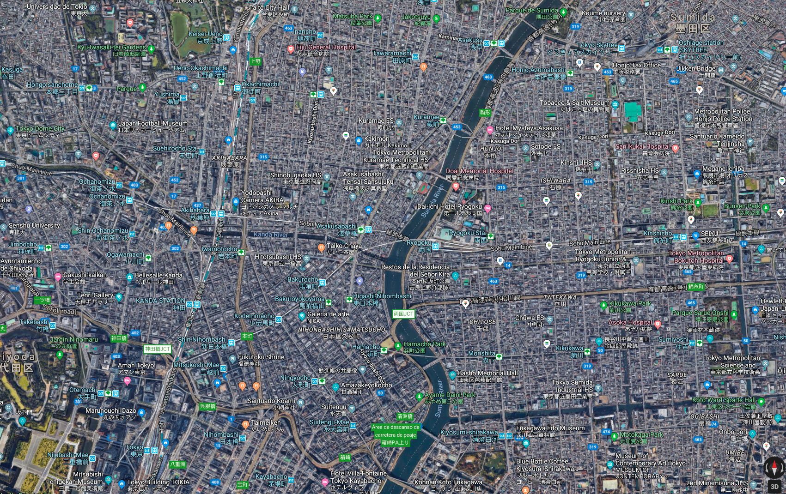

# Some stuff my awesome colleagues and I did

# #What's happening down there?

<video src="videos/era_demo.mp4" controls width="100%"></video>

Dynamic event recognition in UAV videos.

# #Vehicle detection and tracking in UAV videos

​<video src="videos/vehicle_det_track.mp4" autoplay class="embed-responsive rounded" loop muted playsinline poster="" width="100%"></video>

Demo in a busy parking lot, Woburn, Massachusetts, US.

# #Test1
<html>
<head lang="en">
    <meta charset="UTF-8">
    <meta name="viewport" content="width=device-width, initial-scale=1.0, user-scalable=no">
    <title>Definitive Img Comparison slider</title>
    <link rel="stylesheet" href="../src/original/dics.original.css">
    

    

</head>
<body>

    

        
        
        
        
    

    

        
        
    

    

        
        
        
        
        
        
        
        
        
        
        
        
        
        
        
        
        
        
        
        
        
        
        
        
    

    

        
        
    

    
    

    

        
        
        
        
    

    

        
        
        
        
    

    

        
        
        
        
    

</body>
</html>

# #Semantic segmentation of aerial imagery

<link rel="stylesheet" type="text/css" href="image-comparison-slider.css">

    

    
    

An example of the city of Potsdam, Germany.

# #Multi-temporal satellite image sequence analysis

An example of urban expansion in Yanqing, Beijing, China.

# #Ship detection in satellite imagery

<link rel="stylesheet" type="text/css" href="image-comparison-slider.css">

    

    
    

An example of the San Francisco Bay, US.

# #Height estimation from a single satellite imagery

<link rel="stylesheet" type="text/css" href="image-comparison-slider.css">

    

    
    

An example in Berlin, Germany.