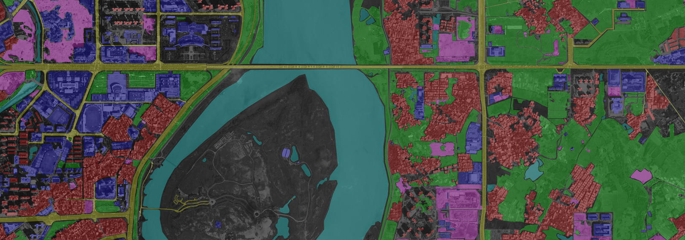

<link href="//maxcdn.bootstrapcdn.com/font-awesome/4.2.0/css/font-awesome.min.css" rel="stylesheet">

[Publications](publications) - [Contact](contact)

* * *

I am currently a Guest Professor at the [Munich AI Future Lab AI4EO](https://ai4eo.de/), [Technical University of Munich](https://www.tum.de/en/) and the Head of Visual Learning and Reasoning team at the Department of EO Data Science, Remote Sensing Technology Institute, [German Aerospace Center](https://www.dlr.de/EN/Home/home_node.html).

## Research interests

I am interested in algorithms for Earth observation data analysis and visual learning and reasoning tasks. My work explores topics in remote sensing, computer vision, and machine/deep learning.

